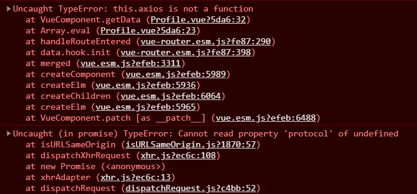

## 在vue中使用axios请求参数时遇到的问题



先说解决办法：**直接交换引入axios时Vue.use()里面参数的顺序****

第一个问题：`this.axios is not a function`

我vue使用axios发送请求的代码如下:

```javascript
beforeRouteEnter: (to, from, next) => {
  console.log("进入路由之前");
  next(vm => {
    vm.getData();
  });
},
beforeRouteLeave: (to, from, next) => {
  console.log("进入路由之后");
  next();
},
methods: {
  getData: function () {
    this.axios({
      method: 'get',
      url: 'http://localhost:8080/static/mock/data.json'
    }).then(function (response) {
      console.log(response)
    })
  }
}
```

main.js中引入vue是这样的：

```js
import MyAxios from 'axios';
import VueAxios from 'vue-axios';
Vue.use(router);
Vue.use(MyAxios,VueAxios);
```

因为控制台报错修改代码如下:

1. 首先因为这里的axios提示不是一个函数，那就说明引入的时候可能没有真的引入进去，修改为

```js
import MyAxios from 'axios';
Vue.prototype.$axios = MyAxios;
import VueAxios from 'vue-axios';
Vue.use(VueAxios,MyAxios);
```

这里的改变是：

+ 将axios直接挂载到属性上面(后面的测试中发现即使不用挂载到属性上也可以)，因为这里改变之后使用axios的代码也要改
+ 这里换了一下VueAxios和MyAxios的顺序(这里主要解决的是第二个问题)

```js
methods: {
  getData: function () {
    this.$axios({
      method: 'get',
      url: 'http://localhost:8080/static/mock/data.json'
    }).then(function (response) {
      console.log(response)
    })
  }
}
```

因为前面是挂到了属性上面，so，在使用的时候直接使用属性

第二个问题：其实也是axios的错误，具体的更改我这里是直接交换了use里面的使用顺序就解决了。

另外注意的点：

+ 请求url里面的地址有没有写错
+ 后面发现只需要调换Vue.use()里面两个参数的位置两个问题都不会出现。。。。

最终结论：

+ 首先保证传递参数的顺序，先是vue-axios，然后才是axios
+ 如果出现上述问题再去看看axios是否需要挂载到属性上


